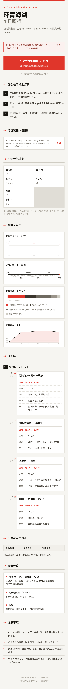

# Itinerary Builder（旅行路书构建器）

[](https://github.com/archsueh/itinerary-builder)
[](https://github.com/archsueh/itinerary-builder)
[](https://github.com/archsueh/itinerary-builder)
[](https://github.com/archsueh/itinerary-builder)

为 AI 智能体（Claude Code / Codex / Gemini CLI 等）设计的**旅行行程规划与路书渲染** Skill。

一句话：**先排得动、站得住，再出一页能带走的页面。**

它做两件别人常混为一谈的事——**决策**（怎么排、为什么这么排、否掉了什么替代方案）与**呈现**（一页手机可打开、自包含、零依赖的精装版 HTML 路书）。两半严格分离：决策必须在渲染之前定死，渲染只消费结果，**不重排、不重新论证**。

覆盖自驾（含**多车多司机**）、骑行、徒步、摩托、公共交通、**出境航班**、以及**多人并行**（有人先返、有人多留、中途换城市）。

---

## 效果

四份示例全部由本仓库的样本渲染器产出，**未做任何后期修饰**。点开图看全页。

### 自驾 · 成都 → 稻城亚丁 6 天


### 骑行 · 环青海湖 4 日（爬升契约）



### 团队 · 7 人 4 地（人员 × 日历泳道图）


### 出境 · 日本大阪进东京出（航班时间线）


---

## 快速安装

```bash
# 方式 A：npx skills（推荐）
npx skills add https://github.com/archsueh/itinerary-builder --skill itinerary-builder

# 方式 B：手动
git clone https://github.com/archsueh/itinerary-builder.git
ln -s "$PWD/itinerary-builder" ~/.workbuddy-ai/skills/itinerary-builder
```

**零运行时依赖**：渲染器与门禁均为 Python 标准库，产出 HTML 自包含（无 CDN、无图表库、无外部字体）。装完即可离线跑。

## 用法

```bash
# 渲染：JSON → 单文件自包含 HTML
python3 scripts/build_swiss.py <data.json> [输出.html]
# 不传输出 → 输入同目录、同名加 "-精装.html"

# 门禁 1：文本质量（emoji / 越界外链 / 图表 / AI-slop / 注入噪声）
python3 scripts/check_quality.py <输出.html>

# 门禁 2：布局（320/375/430/768 四个视口查横向溢出，需 Node + Playwright）
node scripts/probe_layout.js <输出.html>
# 若 playwright 已装在别处，用 NODE_PATH 指过去即可，不必重装：
#   NODE_PATH=<path/to/node_modules> node scripts/probe_layout.js <输出.html>
# 退出码：1 = 有溢出，2 = 加载不到 playwright（NODE_PATH 未设），3 = 用法错误 / 未预期错误

# 示例与样本的防漂移校验
python3 scripts/build_examples.py --check     # CI 用
python3 scripts/build_examples.py --write     # 改完样本后重建
```

---

## 设计哲学

### 决策与呈现不能混

```
需求澄清 → 核实 → 质疑 → 论证(decisions) → itinerary.json → 渲染 HTML → 门禁 → 交付
   §1       §2     §3      §4              §5               §6        §8     §8
```

本 Skill 的核心价值在 **§3 质疑**：按硬约束逐条过（单日驾驶上限、过夜中点、高原阶梯、节假日错峰、游玩密度、出行主体、骑行爬升双限、出境跨时区），不合理就**明确指出 + 给替代方案 + 里程对比**。每一处取舍都落在 `decisions[]` 里——渲染时忽略，但**人必读**。

> 例：「Day2 宿康定而非直奔稻城 —— 折多山后海拔 2560m 是首个适应点，硬推到 3700m 高反风险显著上升（替代方案：Day1 直奔，省 1 天但放弃适应）」

### 包豪斯精装版：单一强调色，无例外

墨黑 `#16140f` + 单一朱红 `#e0362b`、发丝线、扁平、序号分区。**全页只有一个强调色**。

唯一的例外是**泳道图**——因为「哪个城市」本身就是信息，允许用类别色相，但必须取低饱和土色系（`#c96442` / `#8b7355` / `#5c6b73` / `#7a6a4f`），禁止彩虹色。其余图表仍守单一强调色。

### 数值字段只给数字

要画进图的字段必须给裸数字，不要 `"约340km"` 这种带单位字符串——否则画不出来。**画不出来就跳过那张图，不要编一个值。**

---

## 数据契约

字段与渲染器严格对齐。完整口径见 [`references/roadbook-spec.md`](references/roadbook-spec.md)。

### 顶层字段

| 字段 | 用途 | 备注 |
|---|---|---|
| `title` / `eyebrow` / `title_lines[]` / `subtitle` | 报头 | `title_lines` 是两行大标题 |
| `amap_uri` | 唤起高德 App 的按钮 | 无高德 MCP 时用 `uri.amap.com/search?...&callnative=1` 兜底 |
| `route_line` | 报头下一行路线摘要 | 纯文本 `A → 转机 → B 3 晚 → C`，**渲染器不做推导** |
| `stays[]` | 报头住宿一览 | `name/nights/status` |
| `weather[]` | 气温区间图 + 天气卡 | 见下方「天气契约」 |
| `weather_note` | 预报时效声明 | 高德只有约 4 天 |
| `stages[].stops[]` | 逐日时间轴 | `date/time/name/km/weather/spots/food/tickets/tips` |
| `flights[]` | **航班时间线** | `leg/date/no/from/to/dep/arr/dur/pax/note` |
| `decisions[]` | 论证（不渲染） | `id/conclusion/reason/rejected_alternative/tradeoff` |
| `tickets[]` / `tickets_total` | 门票表 | `name/price/book` |
| `clothing[]` | 穿着卡 | `group/items` |
| `tips[]` | 注意事项 | 字符串数组 |
| `budget_note` | 预算口径声明 | 紧贴预算图 |
| `footer` | 页脚 | **里程/天气来源写这里**，不另设字段 |
| `viz` | 图表数据块 | 见下 |

### 天气契约（`weather[]`）

一格 = **主标签 + 温度行 + 说明**。三件事各自可选：

| 想表达 | 写法 | 渲染结果 |
|---|---|---|
| 城市 + 区间 | `{"city":"OSAKA","label":"D1–D3","day":26,"night":19,"text":"…"}` | `OSAKA` / 副标签 `D1–D3` / `<b>26°</b>/19° |
| 非城市格（乐园 / 风险 / 场馆） | `{"label":"USJ","temp":"25°/19°","text":"…"}` | `USJ` / 无副标签 / `<b>25°/19°</b>` |
| 无温度可给 | `{"label":"TYPHOON","temp":"—","text":"…"}` | 温度位 `<b>—</b>` |

**图表侧只把 `day`/`night` 都能转成数字的格子画进气温区间图**，非数值格整格跳过——不要为了出图给它们塞 `0`，那会把纵轴下限拽到冰点。

### 航班（`flights[]`）——出境 / 长途中转

**航空段不是地面段**：把飞行的里程塞进 `viz.route[]` 会把地面路线图压扁（东京→大阪新干线的 515km 被 3000km 航段挤成一根线）。所以航空段**只进 `flights[]`**。

```json
{"leg":"去程","date":"10/6","no":"东航 MU5642","from":"厦门高崎 T4","to":"上海浦东 T1",
 "dep":"08:05","arr":"10:10","dur":"飞 2h5m","pax":"两人","note":"中转 4h35m，先确认是否联程"}
```

- `leg` 相同值的连续行**自动归组**成「去程 / 返程 / 中段」小标题；按数组顺序输出，不排序。
- `pax` 写「两人 / 你 / 对象」——**多人不同机时这是关键信息**。
- **渲染器不做时区运算**：跨时区的落地时刻由规划阶段算好后填入 `arr`，次日写 `00:05+1`。这是刻意的——让机器猜时区比让人写错更危险（错误会被当成事实渲染出去）。

---

## 图表

`scripts/build_viz.py` 把数据画成**内联 SVG**（无图表库、无 CDN，页面自包含）。**数据缺失的图静默跳过——想出图就必须给 `viz`。**

| 数据 | 字段 | 产出图 | 最少条数 |
|---|---|---|---|
| `weather[]`（顶层） | `city/label/day/night/temp` | 沿途气温区间（昼/夜） | ≥1 格可转数字 |
| `viz.route[]` | `name/km/hours/note` + 可选 `m`/`gain` | 路线示意（累计里程） | ≥2 |
| `viz.elevation[]` | `km/m` | 海拔剖面（**可省略**） | ≥2 |
| `viz.budget[]` | `label/amount` | 预算构成（堆叠条） | ≥1 |
| `viz.swimlane` | `dates/cities/lanes/verify` | **人员 × 日历泳道（多人并行）** | dates ≥2, lanes ≥1 |

**爬升是骑行/徒步的第一性数据**：`route[].m` 给该节点海拔、`route[].gain` 给段累计爬升。下游据此标 `80 km · 5h · ↑320m`、算「等效 +Xkm」（每 100m 爬升 ≈ +1km）、并**自动推导海拔剖面**——所以 `elevation[]` 可以不给，避免两处 km 人工对齐而漂移。

**多人出行必须出泳道图**：只要不是所有人同进同出，`viz.route` 的单线示意就画不了。

---

## 门禁

两道，都必须 PASS 才交付。

| 门禁 | 查什么 | 退出码 |
|---|---|---|
| `scripts/check_quality.py` | emoji 残留、越界外链（应只有高德）、至少一张 SVG、AI-slop 样式（紫渐变/霓虹/`#0D1117`）、注入属性噪声 | 1 = 未过 |
| `scripts/probe_layout.js` | 320/375/430/768 四个视口的横向溢出，失败时列出越界元素的 tag/class/文字 | 1 = 有溢出 |

**为什么需要第二道**：路书是在手机上打开的，一个没加 `min-width: 0` 的 grid 或一处 `white-space: nowrap` 就会让整页左右能拖——在手机上表现为「右边被切掉」，而 **HTML 本身完全合法**，第一道门禁查不出来。

> ⚠️ **不要用 Chrome 无头截图目测布局**：`--window-size=430 --force-device-scale-factor=2` 出的图会**假性裁切**（右侧看似被切、还出现一条红色竖线），页面其实没溢出。**量 DOM，不要看图。**

---

## 示例

| 示例 | 样本 | 覆盖的契约 |
|---|---|---|
| [`examples/01-selfdrive-chengdu-daocheng.html`](examples/01-selfdrive-chengdu-daocheng.html) | `assets/itinerary.sample.json` | 自驾完整四图 + `decisions[]` |
| [`examples/02-bike-qinghai-lake.html`](examples/02-bike-qinghai-lake.html) | `assets/itinerary.bike.sample.json` | `m`/`gain` 爬升契约，故意不给 `elevation[]` |
| [`examples/03-team-swimlane.html`](examples/03-team-swimlane.html) | `assets/itinerary.team.sample.json` | `viz.swimlane` 泳道图（7 人 × 11 天） |
| [`examples/04-flight-japan.html`](examples/04-flight-japan.html) | `assets/itinerary.flight.sample.json` | `route_line` / `stays[]` / `flights[]` + 非城市天气格 |

`examples/*.html` 是**生成物但入库**——为了让 clone 下来不跑任何东西就能浏览。**不要手改**：CI 会重新渲染并逐字节比对，不同步直接失败。改完样本跑 `python3 scripts/build_examples.py --write`。

> 样本中的所有里程、价格、天气均为**示例值，未经核实**，仅用于演示契约。真实行程必须按 SKILL.md §2 逐项核实并标注来源。

---

## 仓库结构

```
SKILL.md                      Skill 主文件：决策 §1–§4 + 契约 + 呈现 §5–§6
CHANGELOG.md                  变更记录，含每次的向后兼容性判定
CONTRIBUTING.md               贡献指引
assets/*.sample.json          4 份样本 —— 契约的可执行定义
examples/*.html               4 份渲染成品（生成物，入库供浏览）
docs/screenshots/             示例截图（430px 视口 ×2x，全页 + 首屏）
references/
  planning-rules.md           §1–§11 行程合理性质疑规则（规划阶段必读）
  roadbook-spec.md            JSON 字段与交付口径（每次产出必读）
  design-language.md          瑞士/包豪斯设计令牌 + 反 slop 清单
  amap-tools.md               高德 MCP 参数与调用顺序
scripts/
  build_swiss.py              JSON → 包豪斯精装版 HTML（纯标准库）
  build_viz.py                JSON → 内联 SVG 图表（纯标准库）
  check_quality.py            文本质量门禁（纯标准库）
  probe_layout.js             布局门禁（Node + Playwright）
  build_examples.py           示例重建 / 防漂移校验
```

---

## 已知边界

- **无高德 MCP 时里程是估算值**，这是可信度下限，必须在输出里声明（写在 `footer`，标明是高德实测还是公开估算）。
- **跨时区不做机器换算**：`flights[].arr` 由人算好后填入，渲染器只负责排版。
- **单页滚动，不是多页小册子**。本 Skill 的核心交付物含一整套交互（高德唤起 CTA、复制链接、微信打开提示），多页印刷模型里没有它们的位置。
- **无衬线标题是刻意选择**，不提供衬线选项。
- **兜底重皮是「重皮」非「重排」**：保留时间轴/按钮/表格结构，只换视觉语言。

## 相关 Skill

- [archviz-layout](https://github.com/archsueh/archviz-layout) — 建筑学图面排版与视觉设计
- [archviz-diagram](https://github.com/archsueh/archviz-diagram) — 流程图 / 框架图 / 数据可视化
- [archviz-3d](https://github.com/archsueh/archviz-3d) — 3D 空间可视化

## License

MIT
